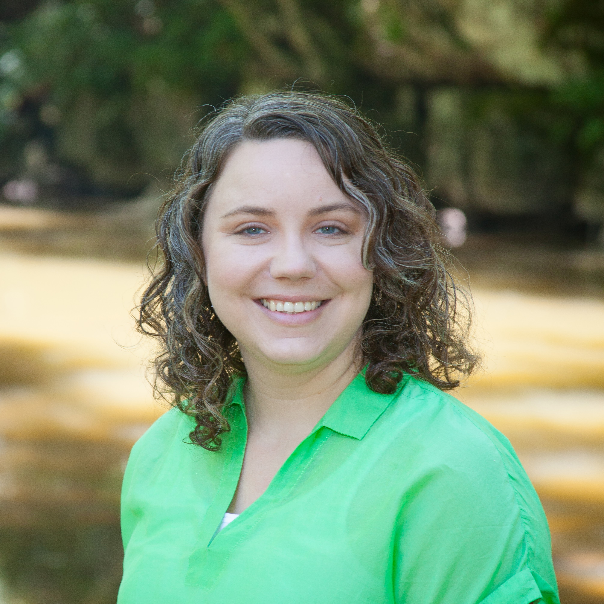
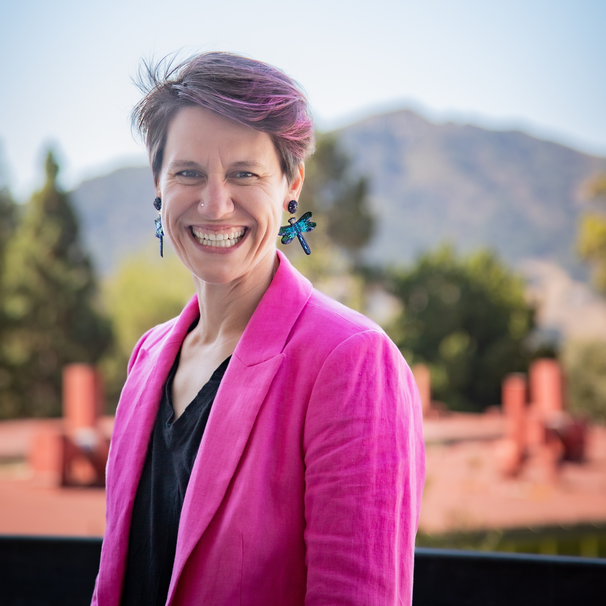

## About the Organizers
### Judith Canner, PhD

::: {layout="[[30,70]]"}

{fig-align="left" fig-alt="A picture of Judith Canner" class="rounded-circle"}

Judith Canner is a Professor of Statistics in the Department of Mathematics and Statistics at California State University Monterey Bay (CSUMB). She established the Statistics and Data Science Major, Statistics Minor, and the Data Science Minor at CSUMB and she the current Department Chair. In addition to her focus on the growth of the Statistics and Data Science Program at CSUMB, she is also the co-PI on an NSF S-STEM grant to support scholarships for statistics and data science undergraduates, the CA Learning Lab Grant to build faculty development groups in data science, and a NSF iUSE grant to research equitable pair programming pedagogy in the data science classroom. In her free time, she enjoys hiking, camping, and learning Spanish.

:::

### Allison Theobold, PhD

::: {layout="[[30,70]]"}

{fig-align="left" fig-alt="A picture of Allison Theobold" class="rounded-circle"}

Allison Theobold is an Assistant Professor of Statistics at Cal Poly, where they teach statistics and data science across undergraduate and graduate programs. Allison’s research focuses on educational environments that support students’ disciplinary identities and data science learning pathways. Outside of work, Allison enjoys running and biking in San Luis Obispo, watching women’s basketball, and sipping cortados.

:::

