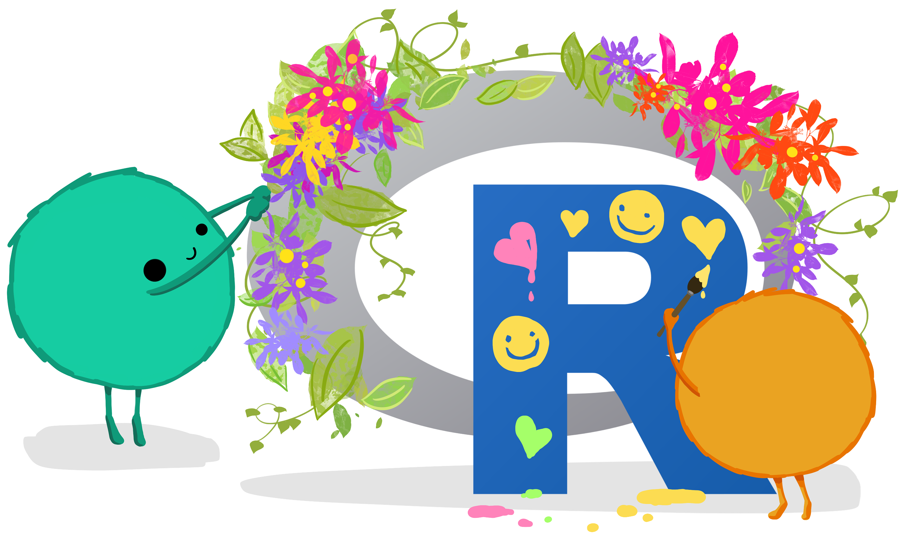

{fig-alt=""}

## Details

**Location**: Gerdin 0129, Iowa State University  
**Date**: Friday, July 18, 2025  
**Time**: 2:45pm - 4:00pm CT  

## Description

STEM classrooms act as disciplinary communities and students’ sense of belonging within classrooms is directly associated with their dispositions towards a particular field. Yet, high attrition rates for students with marginalized identities suggest students may not feel a sense of belonging in STEM disciplines. Group work is one method of supporting student’s engagement and sense of belonging in undergraduate classrooms. In Computer Science education, pair programming is a recommended pedagogical tool for enhancing students’ learning and sense of belonging. However, research has found that pair programming can also be subject to inequitable interactions, contribute to disparities of power and status, and squelch some students’ opportunities to learn and develop discipline-based identities. In this session, participants will engage with collaborative protocols and activities (both programming and norm establishing) developed to foster equitable collaborations. We will outline findings from our research to motivate how we developed and revised these protocols based on the collaborative experiences of students with marginalized identities. Participants will also engage in discussions around challenges and questions about implementation within their own classrooms. This session is intended for anyone currently using or interested in using collaborative programming in their course(s), but may also be useful for instructors employing group collaborations in non-programming contexts. Portions of the session will require attendees to have access to a laptop, and a basic understanding of R (e.g. RMarkdown/Quarto, dplyr, ggplot2).

::: {layout="[[80,20]]"}

This material is based upon work supported by the National Science Foundation under Grant Numbers #2334989 and #2334988. *Any opinions, findings, and conclusions or recommendations expressed in this material are those of the author(s) and do not necessarily reflect the views of the National Science Foundation.*

{fig-align="right" fig-alt="NSF logo featuring a blue globe with white NSF letters in front, surrounded by a gold gear-like border."}

:::
