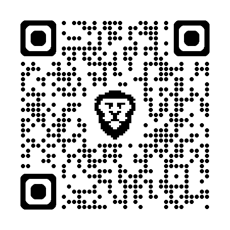
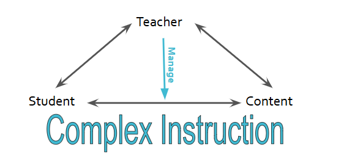
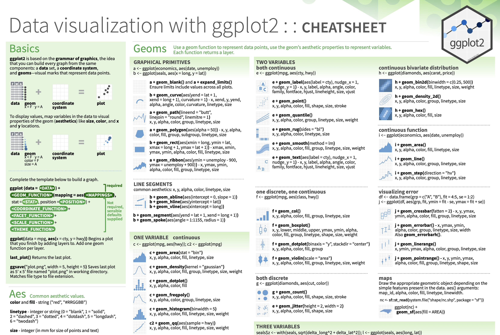

## Overview

- Pair Programming
- Establishing Equitable Participation
  - Broken Circles Activity
  - Discussion
  - Pair Programming Activity
  - Discussion
- Classroom Integration

## Access Slides and Activities

(https://bit.ly/uscot-pairs)

{fig-align="center"}

## Ice-Breaker

Find someone with whom you have **three** things in common (that do not include Statistics/Academia).


## Pair Programming History

- Originated in Computer Science (Beck 2000)
- Common in academia and industry
- Pair programming involves two students sitting side-by-side, working on one computer to collaboratively work through a programming problem (Beck, 2000).


## Pair Programming

Programmers alternate who is the “driver” and "navigator" (Williams and Kessler, 2002)

- **The Driver** is responsible for designing, typing the code, and having control over the shared resource (e.g., computer, mouse, and keyboard)  
- **The Navigator** is responsible for providing support to identify errors, offer ideas, or opportunities for improvement. 

## Pair Programming Challenges

- **Status**: Group collaborations fall prey to issues of status—the distribution of power among peers (Cohen and Lotan, 1995)

- **Power & Authority**: Who speaks and whose voice is are recognized are indicative of power and status (Chiu & Khoo, 2003; Esmonde, 2009; Mulryan, 1994).

- **Marginalized Identities**: The oppression students with marginalized identities when collaborating with peers in the mathematics classroom (Leyva et al., 2021) impact the development of students’ mathematical identities (Langer-Osuna, 2011; 2016). 


## Training Students in Equitable Collaboration

**Complex Instruction** as a pedagogy focuses on practices that create structures, protocols, and norms that attend to the ways that status characteristics lead to unequal power and participation (Cohen et al., 1997). 

{fig-alt="Triangle with teacher at top, Student in the left corner and Content in the right corner, with two-way arrows pointing between each. An arrow pointing from the Teacher to the middle of the arrow between Content and Student states 'Manage'." fig-align="center"}

<!-- ALLISON Add to slide! -->
<!-- Hold 2012 -->

## Complex Instruction

::: {.panel-tabset}

## [Roles & Norms]{.small}

::: {.midi}
Develop autonomy of and interdependence of small groups through the use of norms, roles and other structures of participation
:::

## [Group-worthy Tasks]{.small}

::: {.midi}
Provide curricular activities that are open-ended, rich in multiple abilities, and support learning important math concepts and skills central to a big idea.
:::

## [Status & Accountability]{.small}

::: {.midi}
Attending to the status of individuals through instructor who manages status and holds individuals and small groups accountable for participation and understanding.
:::
::: 

# [Activity 1: Broken Circles](../group-tasks/week-1/broken-circles.qmd){target=_blank}


## Broken Circles Discussion

-   What do you think this game was about? What was its purpose?
-   What did your group did that made you cooperate more successfully?
-   What did your group did that made cooperation harder?
-   What are some behaviors that could be implemented in the future to make cooperation easier?


## Establishing Norms 

We can't just say “you need to work together”, we need to say “you work together by…”

<!-- It is important to draw direct links between the norms and behaviors that we see because the desired behaviors we are training the students for really do need to be specific and not broad. For example.  -->

::: {.incremental}
- Not doing the task for another person

- Not just giving an answer but an explanation

- Providing concise sharing / description of what is being done and reasoning for why it's being done

::: 

## Equitable Participaiton Training Procedures

What behaviors encourage equitable participation?

::: {.incremental}

- Say your own ideas

- Listen to others

- Give everyone a chance to talk

- Ask others for their ideas

- Give reasons for your ideas and discuss any and every different idea

:::

## Evaluating Group Participation

How do we know our group is engaging in equitable participation?

::: {.incremental}

- Is everyone talking?

- Are you listening to each other?

- Are you asking questions?

- What could you ask to find out someone's ideas?

- Are you giving reasons for your ideas?

- How do you ask for reasons from others?

:::


# [Pair Programming Protocols](../group-tasks/pair-programming-norms.qmd){target=_blank}

## Roles in Pair Programming

::: columns
::: {.column width="50%"}
Coder: Proposes Solution Strategies

::: {.small}
- Reads out instructions or prompts
- Directs the Developer what to type in the Quarto document in RStudio
- Talks with Developer about ideas related to ways they could solve the problem.
- Manages resources (e.g., cheatsheets, textbook) for aiding in solution strategy.
:::
:::

::: {.column width="50%"}
::: {.fragment}
Developer: Evaluates Solution Strategies

::: {.small}
- Asks the instructor group questions.
- Types the code specified by the Coder into the Quarto document. 
- Listens carefully, asks the Coder to repeat statements if needed, or to slow down.
- Encourages the Coder to vocalize their thinking.
- Asks the Coder clarifying questions.
- Runs the code provided by the Coder.
:::
:::
:::
:::

Notice the difference between the original "Driver" and "Navigator".

# [Activity 2: Find the Penguins](../group-tasks/week-4/pa-3-ggplot.qmd){target=_blank}

## `ggplot2` Review

Complete this template to build a basic graphic:

```{r}
#| eval: false
#| echo: true
#| code-line-numbers: false

ggplot(
  data = <DATA>, 
  mapping = aes(<MAPPINGS>)
  ) +
  <GEOM FUNCTION>() + 
  any other arguments...
```

. . .

Notice, every `+` adds another **layer** to our graphic.

. . .


# Peer Activity: Using Data Visualization to Find the Penguins


## Using Data Visualization to Find the Penguins

::: columns
::: {.column width="60%"}
::: {.small}
This puzzle activity will require knowledge of:

- installing and loading packages in R
- formatting code chunks in Quarto
- interpreting the context of a dataset
- data types / variable types
- different types of visualizations
- what visualization(s) go with different data types
- how to make visualizations with **ggplot2**
- choosing between different aesthetic options
:::
:::

::: {.column width="5%"}
:::

::: {.column width="35%"}
::: {.fragment}
::: {.midi}
**None of us have all these abilities. Each of us has some of these abilities.**
:::
:::
:::
:::

## Pair Programming Expectations

::: {.small}
During your collaboration, you and your partner will alternate between two roles: 
:::

. . .

::: columns
::: {.column width="49%"}
**Developer**

::: {.small}
-   Reads prompt and ensures Coder understands what is being asked. 
-   Types the code specified by the Coder into the Quarto document.
<!-- -   Listens carefully, asks the Coder to repeat statements if needed, or to slow -->
<!-- down. -->
<!-- -   Encourages the Coder to vocalize their thinking. -->
<!-- -   Asks the Coder clarifying questions. -->
<!-- -   Checks for accuracy by asking the solution to be restated for clarity. -->
<!-- -   **Does not** give hints to the Coder for how to solve the problem.  -->
<!-- -   **Does not** solve the problem themselves.  -->
-   Runs the code provided by the Coder. 
-   Works with Coder to debug the code. 
<!-- -   **Does not** tell the Coder how to correct an error. -->
-   Evaluates the output.  
-   Works with Coder to write code comments. 
:::
:::

::: {.column width="2%"}
:::

::: {.column width="49%"}
::: {.fragment}
**Coder**

::: {.small}
-   Reads out instructions or prompts
-   Directs the Developer what to type. 
-   Talks with Developer about their ideas. 
<!-- -   **Does not** ask the Developer how they would solve the problem.  -->
-   Manages resources (e.g., cheatsheets, textbook). 
<!-- -   **Does not** ask the developer what functions / tools they should use.  -->
-   Works with Developer to debug the code. 
<!-- -   **Does not** ask the Developer to debug the code.  -->
-   Works with Developer to write code comments. 
:::
:::
:::
:::

## 

::: {.callout-tip}
## Group Norms

1.  Think and work together. Do not divide the work.
2.  You are smarter together.
3.  Be open minded. 
4.  No cross-talk with other groups.
5.  Communicate with each other! 
:::

<!-- Add other norms that are relevant -->

<!-- Add in discussion of benefits of speaking your code out loud -->
<!-- - deeper understanding -->
<!-- - practice communicating ideas -->
<!-- - explaining your thinking -->

## ggplot2 Resources

Every group should have a **ggplot2** cheatsheet! 

::: columns
::: {.column width="33%"}
::: {.fragment}
**On the Front**

::: {.incremental}
::: {.small}
- Column 1: the "template" for making a ggplot
- Column 3: creating plots for two continuous variables
- Column 4: creating plots for one discrete or one continuous variable
:::
:::
:::
:::

::: {.column width="3%"}
:::

::: {.column width="30%"}
::: {.fragment}
**On the Back**

::: {.incremental}
::: {.small}
- Column 4: adding facets and labels to your plot
- Column 3: adding themes to your plot (if you have extra time)
:::
:::
:::
:::

::: {.column width="3%"}
:::

::: {.column width="30%"}
{fig-alt="A picture of the ggplot2 cheatsheet, which contains helpful information on assembling a variety of visualizations all using the ggplot2 package."}

:::
:::


## Discussion

- Was it easy or hard to stay "in your role"?
- How did the roles contribute to equitable participation?
- What was the instructor role during this activity?


# Classroom Integration

## Think about your classes...

- How does fit within your current classes/teaching?
- How do you think this would help your students learn programming?
- What challenges do you foresee? 
- What opportunities does this provide?

# Thank you!

